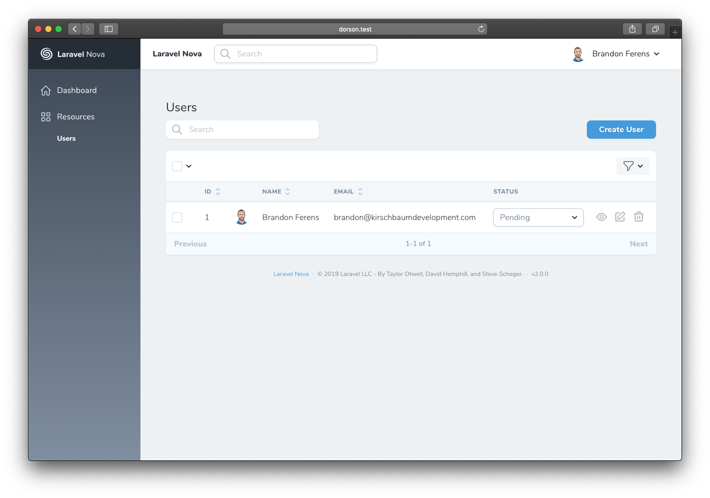
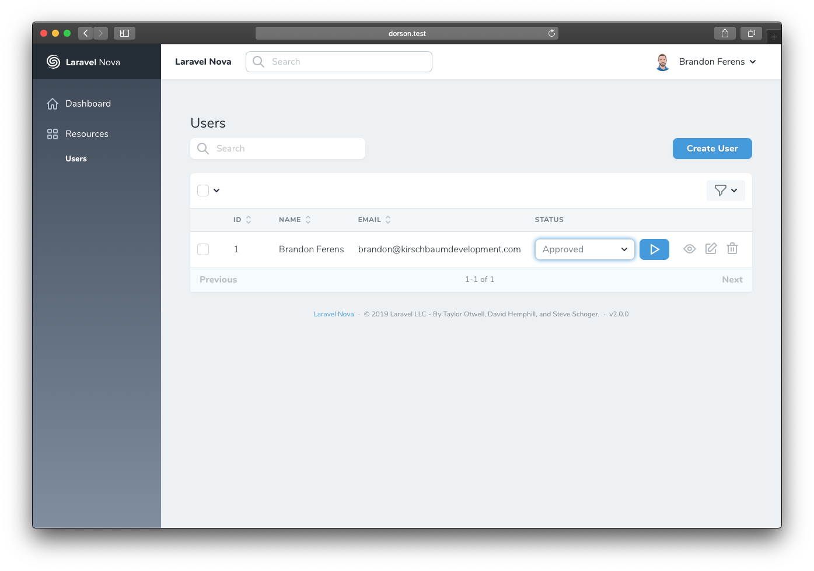

# An inline select field for Nova apps

[](https://packagist.org/packages/kirschbaum-development/nova-inline-select)
[](https://packagist.org/packages/kirschbaum-development/nova-inline-select)
[](https://github.com/kirschbaum-development/nova-inline-select/actions)

This package contains a Nova select field that can update field values inline from the index and detail views.




## Requirements

| Nova Version | Inline Select Version |
|--------------|-----------------------|
| v1-3         | `^1.0`                |
| v4           | `^2.0`                |

This Nova field requires Nova 1.0 or higher.

## Installation

You can install this package in a Laravel app that uses [Nova](https://nova.laravel.com) via composer:

```bash
composer require kirschbaum-development/nova-inline-select
```

## Usage

Next you can use the `KirschbaumDevelopment\Nova\InlineSelect` field in your Nova resource:

```php
namespace App\Nova;

use KirschbaumDevelopment\Nova\InlineSelect;

class User extends Resource
{
    // ...

    public function fields(Request $request)
    {
        return [
            // ...

            InlineSelect::make('Status'),

            // ...
        ];
    }
}
```

Use the `InlineSelect` field just like Nova's `Select` field. But now for the magic...

### Inline editing

By default, the inline select field works just like a normal select field. To enable the inline editing capabilities we can use the `inlineOnIndex()` and `inlineOnDetail()` methods.

```php
InlineSelect::make('Status')->options($options)
    ->inlineOnIndex()
    ->inlineOnDetail(),
```

The above inline select field will show up on both the index and detail views. When making a change to the select field, a button will display next to the field allowing you to commit the change. If you would rather the field auto-submits the change, simply add `enableOneStepOnIndex()` or `enableOneStepOnDetail()`.

```php
InlineSelect::make('Status')->options($options)
    ->inlineOnIndex()
    ->enableOneStepOnIndex(),
```

The inline select field on the index view now will auto-submit the changed value. You can also continue to use the old `disableTwoStepOnIndex()` method if you choose, which just calls `enableOneStepOnIndex()` under the hood.

You can also add the inline select to Lenses. Use the `inlineOnLens()` method. Auto-submitting works the same as well with `enableOneStepOnLens()`.

```php
InlineSelect::make('Status')->options($options)
    ->inlineOnLens()
    ->enableOneStepOnLens(),
```

### Display using labels

This method works just like Nova's select field. It will display the option value rather than the option key.

```php
InlineSelect::make('Status')->options($options)
    ->displayUsingLabels(),
```

### Using closures as  `options()` argument

You may pass a closure to the options method. It must return a key value pair array.

```php
InlineSelect::make('Status')
    ->options(function () {
        return [
            'one' => 'foo',
            'two' => 'bar',
        ];
    }),
```


### Validation caveats

In the case where fields on a model are `required`, which is likely, an extra step needs to be taken to ensure the inline select update persists and doesn't throw an error. The validation rule `sometimes` needs to be added to the `updateRules()` method on any field that is `required`.

```php
Text::make('Email')
    ->rules('required', 'email')
    ->updateRules('sometimes'),
```

## Changelog

Please see [CHANGELOG](CHANGELOG.md) for more information on what has changed recently.

## Contributing

Please see [CONTRIBUTING](CONTRIBUTING.md) for details.

### Security

If you discover any security related issues, please email brandon@kirschbaumdevelopment.com or nathan@kirschbaumdevelopment.com instead of using the issue tracker.

## Credits

- [Brandon Ferens](https://github.com/brandonferens)

## Sponsorship

Development of this package is sponsored by Kirschbaum Development Group, a developer driven company focused on problem solving, team building, and community. Learn more [about us](https://kirschbaumdevelopment.com) or [join us](https://careers.kirschbaumdevelopment.com)!

## License

The MIT License (MIT). Please see [License File](LICENSE.md) for more information.
